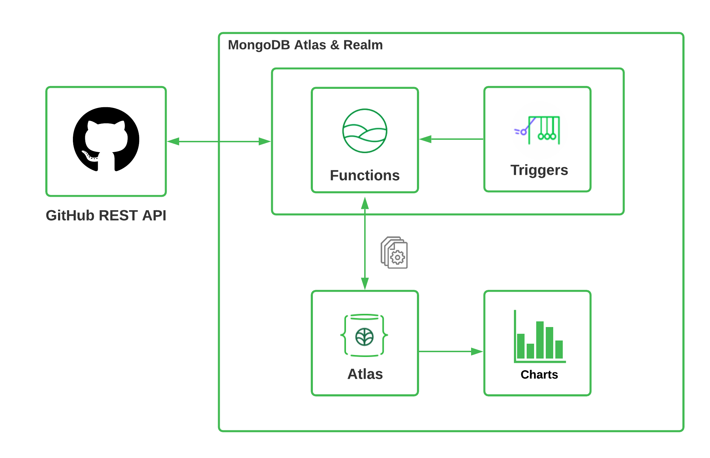

# GitHub Reporting And Integration Platform (GRIP)
The GitHub Reporting And Integration Platform (GRIP) uses APIs to sync and visualise data from GitHub databases.

# GRIP Architecture

## Tech

-   [MongoDB-Atlas] - MongoDB Atlas is a multi-cloud database service by the same people that build MongoDB. MongoDB Atlas makes it easy to deploy and manage databases on-demand when and where you need them.
-   [MongoDB-Realm] - MongoDB Realm is a development platform designed for modern, data-driven applications. You can use Realm to build mobile, web, desktop, and IoT.
-   [MongoDB-Charts] - MongoDB Charts gives you a quick, simple, and powerful way to perform data visualization with MongoDB Atlas data.
-   [JavaScript] - JavaScript (JS) is a lightweight, interpreted, or just-in-time compiled programming language with first-class functions.
-   [CodeQL] - CodeQL is the analysis engine used by developers to automate security checks, and by security researchers to perform variant analysis.
-   [VSCode] - Visual Studio Code is a source-code editor.

## License

Apache-2.0 License

[MongoDB-Atlas]: https://docs.atlas.mongodb.com/
[MongoDB-Realm]: https://docs.mongodb.com/realm/
[MongoDB-Charts]: https://docs.mongodb.com/charts/
[JavaScript]: https://developer.mozilla.org/en-US/docs/Web/JavaScript
[CodeQL]: https://securitylab.github.com/tools/codeql/
[VSCode]: https://code.visualstudio.com/
